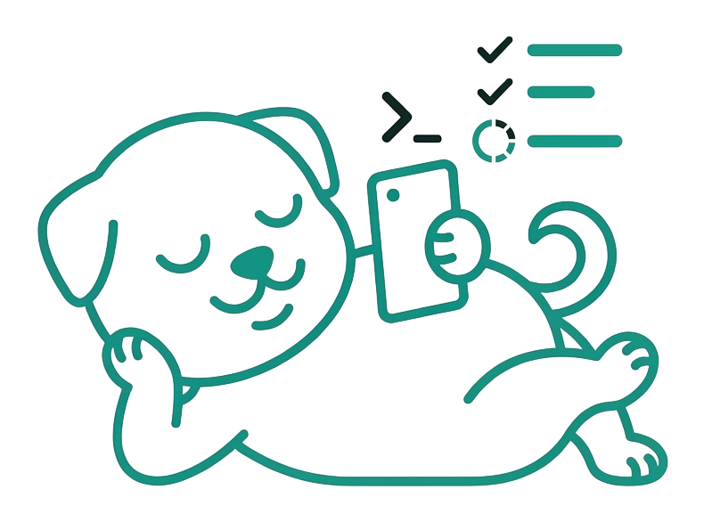
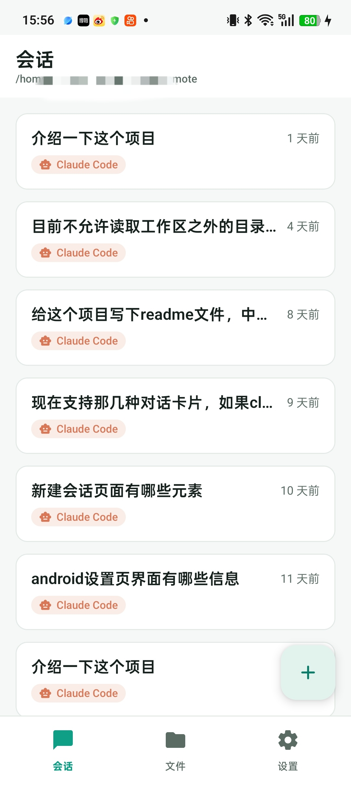
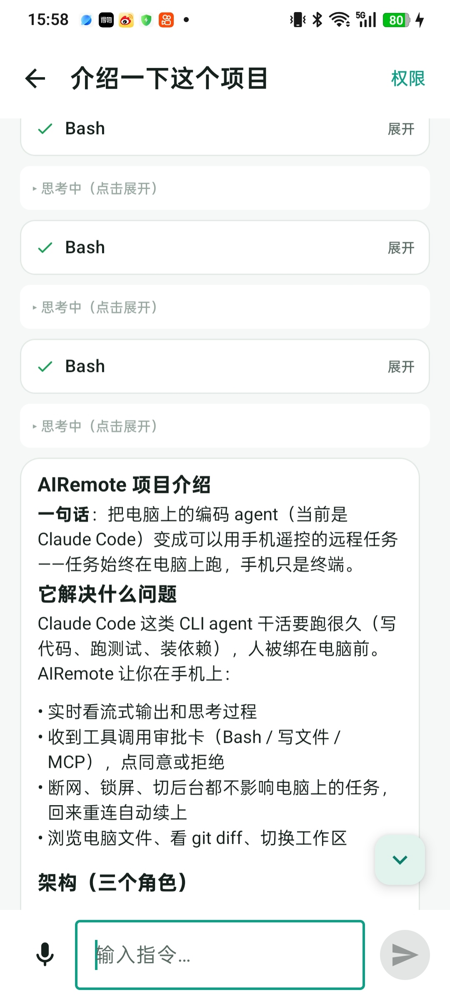
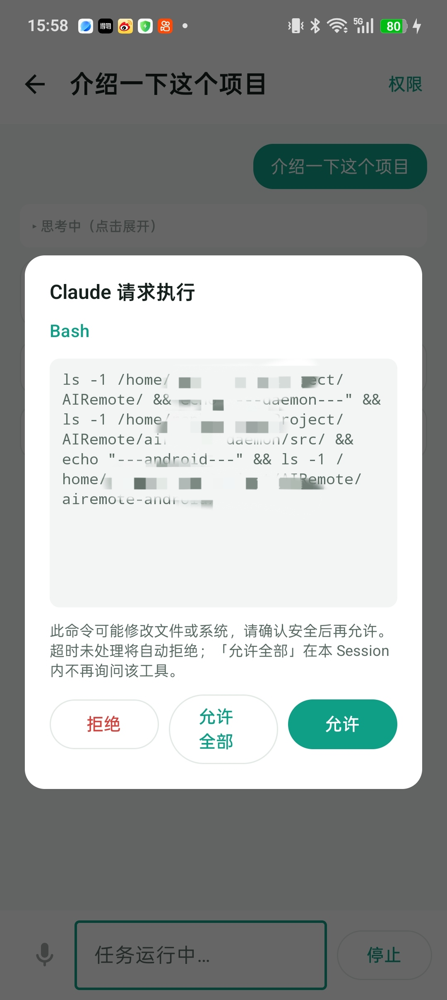
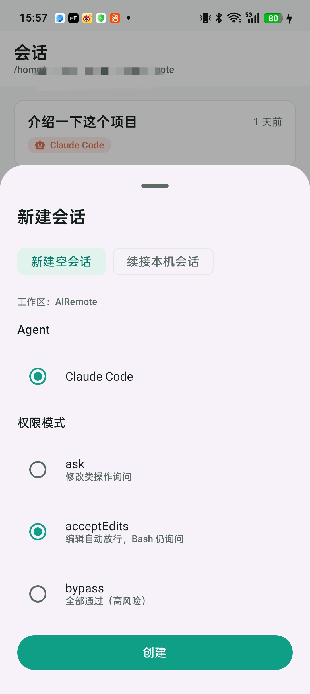
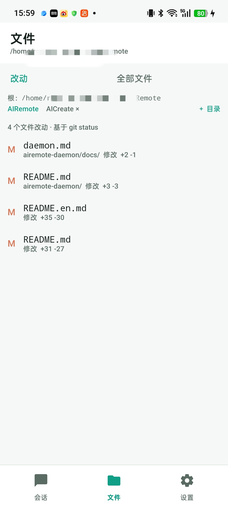
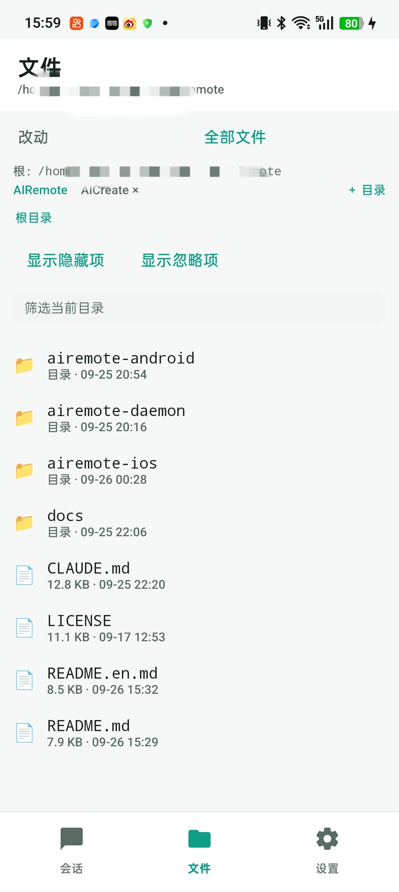
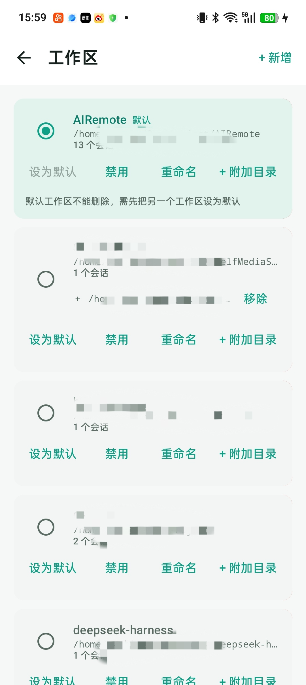
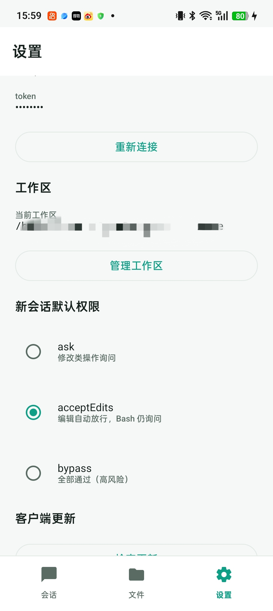

> [English](README.en.md) | 中文

<div align="center">

<picture>
  <source media="(prefers-color-scheme: dark)" srcset="docs/media/mascot-hero-dark.png">
  
</picture>

<h1>AIRemote</h1>

<h4>躺着指挥电脑上的AI Agent 干活</h4>

<h5>咱就说，能不能躺着把活干了</h5>

[📚 **文档**](docs/ui/README.md) • [📱 **Android 客户端**](airemote-android/README.md) • [🖥️ **daemon**](airemote-daemon/README.md) • [🍎 **iOS**](airemote-ios/README.md) • [🔒 **安全模型**](#安全模型-)

[](https://www.npmjs.com/package/@noresign/airemote) [](LICENSE)

</div>

**远程操纵编码 agent。** 电脑上跑一个 daemon，把安装的编码 agent CLI（当前仅支持
Claude Code，后续支持Codex、DSH）以无头方式 spawn 起来，把输出解析成统一的流式事件，通过 HTTP/SSE 推给手机：
在手机上看流式输出、审批工具调用、浏览电脑文件、切换工作区等，不局限于写代码。

手机是远程终端，**任务始终在电脑上执行**——断连不影响任务，重连自动续上。

## 快速开始

### 1. 装 daemon

前置：**Node `~24`**，以及本机已装并登录 `claude` CLI（`claude auth login`）：

```bash
npm install -g @noresign/airemote      # 全局命令名是 airemote

airemote --workspace ~/code/my-project # workspace参数指定工作空间，默认为命令启动目录
```

首次启动会生成 token 并打印，同时打印手机可以连的局域网地址：

```
token: 3f9c…   ← 手机连的时候要填这个
LAN:   http://192.168.1.20:4780
```

- token 持久化在 `~/.airemote/token`，删掉即轮换；也可以用 `--token` 指定
- 完整参数、配置项与 HTTP/SSE 接口见 [airemote-daemon/README.md](airemote-daemon/README.md)。

### 2. 编译 Android 客户端

用 Android Studio 打开 `airemote-android/`（JDK 17，`minSdk 24` / `targetSdk 36`），
选 flavor 后直接 Run。命令行等价于：

```bash
cd airemote-android
./gradlew :app:assembleAlphaDebug
```

两个通道：`alphaDebug`（测试）与 `prodDebug`（正式）；正式签名需要
`airemote-android/keystore.properties`。模块划分与签名说明见
[airemote-android/README.md](airemote-android/README.md)。


### 3. 操作步骤

1. 打开 App，填 daemon 地址（就是启动时打印的那个 LAN 地址）和 token，连接
2. 新建会话 → 选工作区目录 → 发一句话
3. agent 在电脑上干活，手机上看流式输出；要跑 Bash 或写文件时手机上会弹审批卡
4. 想走就走——任务在电脑上继续跑，回来重连自动续上

### 4. 手机电脑不在同一个局域网（可选）

daemon 默认监听局域网，公网连接有以下两种方法：

**(1) SSH 中转** 

适合自用，需要一台公网服务器，在**跑 daemon 的电脑**上执行：

```bash
ssh -N -R 0.0.0.0:4788:localhost:4780 user@your-server
```

然后手机连 `http://your-server:4788`，4788端口为服务器端口，可自定义选择。但要注意：**SSH 只加密了「电脑 → 服务器」这一段，手机到服务器
那一跳仍是明文 HTTP**，token 在这段上等于裸奔——所以这条路只适合自己临时用。

两个容易踩的坑：

- `-R` 默认只在服务器的 **loopback** 上监听，手机连不上；需要在服务器 `/etc/ssh/sshd_config`
  里设 `GatewayPorts clientspecified`
- 隧道断了不会自愈，做成 systemd 服务常驻或用 `autossh -M 0 -N -R ...`

**(2) 组网工具**

把电脑和手机加进同一个虚拟内网，之后就像在同一个 LAN 里一样，直接用 daemon 打印的地址（或虚拟网 IP）连接，daemon 侧不用改任何配置。

- **Tailscale / ZeroTier** —— 装好登录即用，手机端有 App，打不通 NAT 时自动走中继
- **WireGuard** —— 自己搭，最干净，但要维护密钥与路由

好处是**整条链路本来就是加密的**，不用再操心证书和端口暴露。

> ⚠️ 上面任何一种做法都让 daemon 暴露到公网，不再是「只有本机能碰」的，而它驱动的是一个带 shell 权限的
> agent——任何人连上即可指挥它操作你的电脑。因此注意不要泄露 ip 及 token，确保 token 复杂度足够高。


## 功能

| 能力 | 说明 |
|---|---|
| 手机上看流式输出 | 文字与思考过程实时刷出来，工具调用渲染成可展开的卡片 |
| 工具审批 | Bash / 写文件 / MCP 调用转发到手机，点同意或拒绝；**超时或断线默认拒绝** |
| 只读白名单 | `ls` / `cat` / `git status` 这类只读命令自动放行，不打扰你 |
| 断线续传 | run 与连接解耦：手机断网、切后台、锁屏都不影响电脑上的任务，回来接着看 |
| 多会话并发 | 多个会话、多个任务并行跑，互不阻塞 |
| 双向续接 | 电脑上 TUI 开的 Claude 会话能导入手机继续；手机开的会话也能用 `claude --resume` 在电脑接续 |
| 工作区 | 手机可新增 / 切换工作区；每个会话绑定工作区目录，越界访问要审批 |
| 文件与 Diff | 手机上直接看工作区的 Git 未提交改动、单文件 diff、目录树与文本文件；图片 / MP4 可就地预览 |

## 界面

| 会话列表 | 聊天（支持markdown渲染） | 审批浮层 | 新建会话 |
|---|---|---|---|
|  |  |  |  |

| 文件 / Diff（可添加多git目录） | 全部文件 | 工作区管理 | 设置 |
|---|---|---|---|
|  |  |  |  |


## 安全模型 ⚠️

**`workspace` 不是沙箱。** 它只决定 agent 从哪个目录启动（spawn cwd），不限制它能碰哪些路径
——`Read`/`Write`/`Edit` 在 `acceptEdits` 下可直接读写 workspace 之外的文件。文件级隔离需要
OS 层沙箱（bwrap / firejail / 容器），纯靠 CLI 做不到。

daemon 提供的边界：

- **认证**：所有非 health 的 `/api/*` 都要 Bearer token（常量时间比较）
- **权限模式**：默认 `ask`，`bypass` 必须用户在手机上明确切换
- **默认拒绝**：审批超时或客户端断线 → 拒绝
- **只读白名单**：仅放行无 shell 元字符的只读 Bash
- **审计**：chat / cancel / permission_decision / rename / delete 全部记入 `audit_log`

公开网络上使用，请先用ssh中转或者组网工具（Tailscale / ZeroTier / WireGuard）把设备放进一个加密的虚拟内网
（见上文「手机电脑不在同一个局域网」），并保管好 token。只想本机使用就 `--host 127.0.0.1`。

## 状态

- **daemon**：可用（会话 / 审批 / 工作区 / 文件 均已落地）
- **Android**：已实现（连接、会话列表、聊天、审批、新建会话、设置、文件、工作区管理）
- **iOS**：预留，尚未实现
- **多 runtime**：抽象已就位，当前仅支持 Claude Code

## License

Apache-2.0，见 [LICENSE](LICENSE)。
